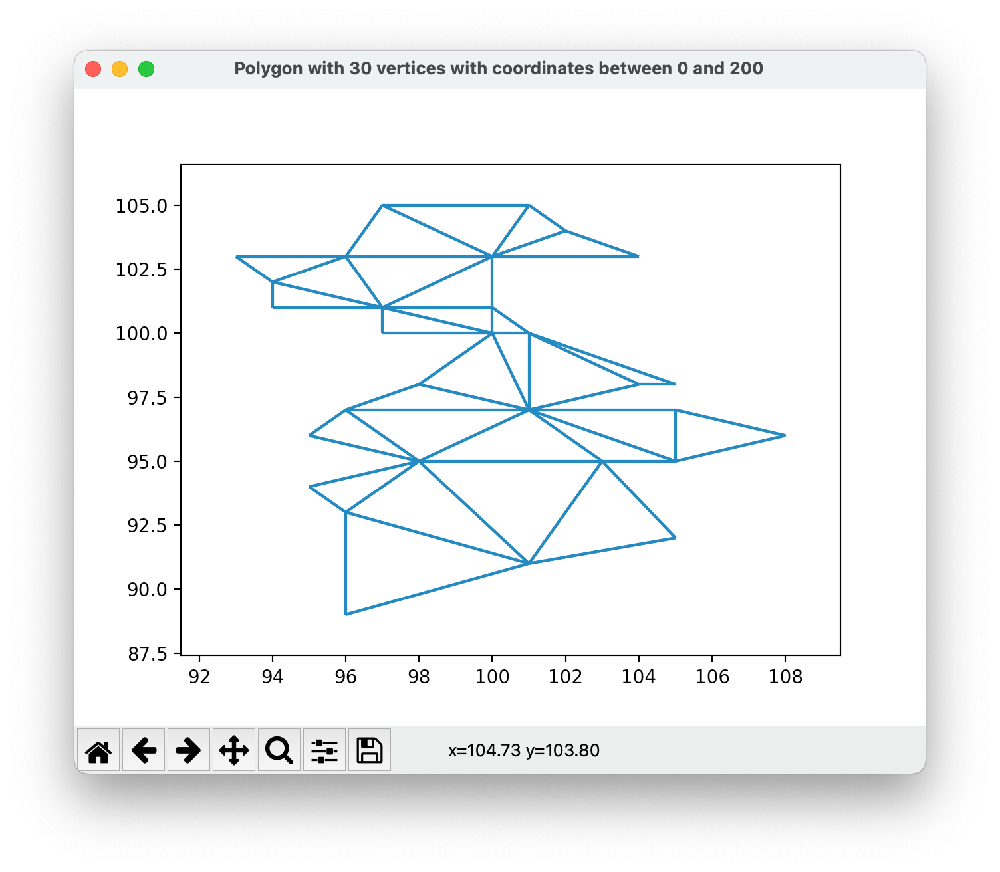

# Polygon Generator
 Polygon Generator based on gluing triangles represented by a DCEL (Doubly Connected Edge List).


Developed as course work for Advanced Topics in Algorithms.

## Dependencies

[Matplotlib](https://matplotlib.org) -  ``` pip install matplotlib ```

## How to run
In Terminal, inside project folder: ``` python polygonGenerator.py ```

You will be prompted to define the number of vertices for the polygon:
```
Nº of vertices:
```
Insert any number higher than 3 to create a polygon. (above 3 will return an error message)


Next you are prompted to choose the maximum value for vertices coordinates:
```
Max value for vertices coordinates:
```
This parameter is used to create smaller polygons with many triangles.
However it may not be possible to create such polygon within this parameters in which case a error message will be displayed and the program will close.

After choosing this parameters the app will generate the polygon and plot it in a separate window as well as printing the DCEL in the terminal.

Generation is random so choosing the same parameters will generate different polygons in each run.

**Exit** by closing the matplotlib window.

## Example
For``` Nº of vertices: 30``` and``` Max value for vertices coordinates: 200```



